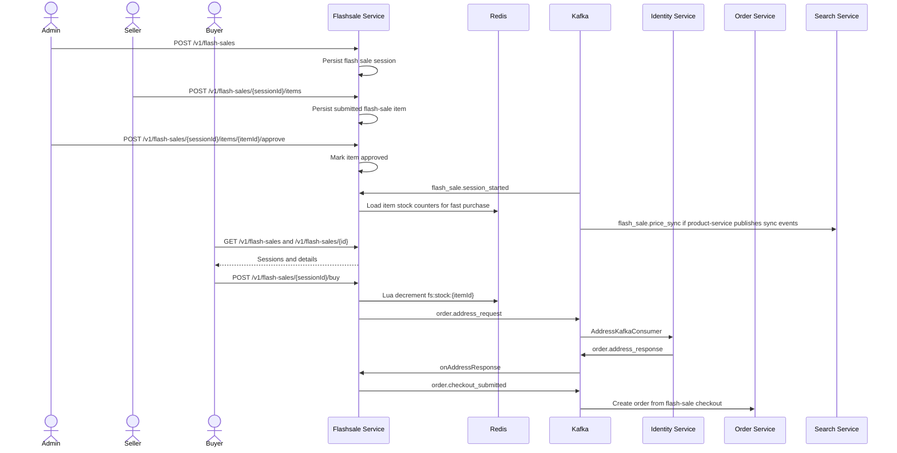

# Business Flow: Flash Sale Session, Item Registration, and Purchase
Scope: `flashsale-service` with identity/order/product/search edges

### Use Case Coverage

| Use case | Status against current code | Evidence | Notes |
|----------|-----------------------------|----------|-------|
| UC-FLASHSALE-001: Admin Create Session | Implemented | `FlashSaleController.createSession` line 40, `FlashSaleService.createSession` line 146 | Admin create/update/delete session endpoints exist. |
| UC-FLASHSALE-002: Seller Register Product | Implemented | `FlashSaleController.createFlashSaleItem` line 75, `FlashSaleService.createFlashSaleItem` line 131 | Admin approve/reject item endpoints also exist. |
| UC-FLASHSALE-003: View Sessions | Partial | `FlashSaleController.getSessions` line 25, `getSessionDetail` line 32 | List/detail exist; `GET /flash-sales/active` from the use case was not found. |
| UC-FLASHSALE-006: System End Session | Partial | `FlashSaleService.onSessionStarted` line 93 | Session-start listener exists; no session-ended consumer/publisher/scheduler was found in this repo snapshot. |

### Sequence Diagram

### Implementation Gaps

| Gap | Impact |
|-----|--------|
| `GET /flash-sales/active` is documented but not implemented in `FlashSaleController`. | Frontend should use `GET /v1/flash-sales?status=ACTIVE` until an active endpoint exists. |
| `flash_sale.session_ended` handling was not found. | Session end/price rollback should be tracked as a missing implementation branch. |
| Reminder endpoints still exist in code, but the current active flashsale use cases no longer include reminders. | Reminder behavior is excluded from this business flow. |
