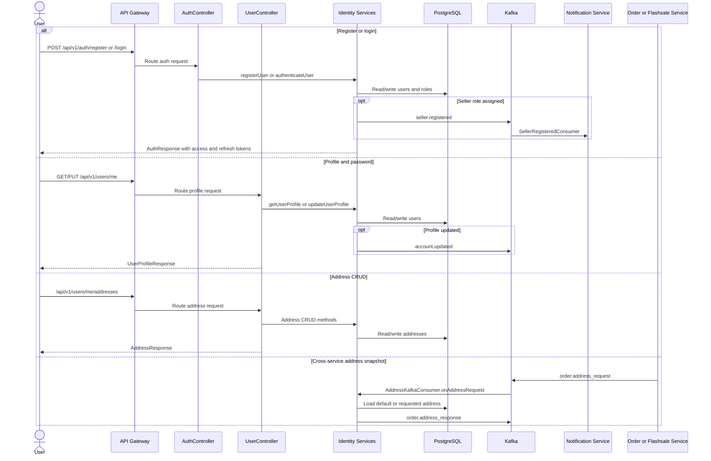

# Business Flow: Identity Access, Profile, and Address
Scope: `identity-service`

### Use Case Coverage

| Use case | Status against current code | Evidence | Notes |
|----------|-----------------------------|----------|-------|
| UC-IDENTITY-001: Customer Registration | Implemented | `AuthController.register` line 67, `AuthService.registerUser` line 42 | Creates a BUYER user and returns auth tokens. |
| UC-IDENTITY-002: User Login | Implemented | `AuthController.login` line 45, `AuthService.authenticateUser` line 114 | Supports credential login, refresh, and logout token blacklist. |
| UC-IDENTITY-003: Manage Profile | Implemented | `UserController.getCurrentUser` line 29, `UserController.updateCurrentUser` line 35, `UserService.updateUserProfile` line 82 | Profile update persists user fields and publishes `account.updated`. Avatar presigned URL is also implemented. |
| UC-IDENTITY-004: Manage Addresses | Implemented | `UserController.getAddresses` line 60, `addAddress` line 66, `updateAddress` line 74, `deleteAddress` line 83 | `AddressKafkaConsumer` also serves cross-service address snapshots. |
| UC-IDENTITY-006: Seller Registration | Implemented | `AuthController.registerSeller` line 135, `UserController.registerAsSeller` line 100, `UserService.registerAsSeller` line 154, `AuthService.publishSellerRegistered` line 126 | Seller registration/role upgrade publishes `seller.registered`; notification-service has a dedicated consumer. |

### Sequence Diagram

### Implementation Notes

| Concern | Current behavior |
|---------|------------------|
| Profile events | `account.updated` is emitted after `PUT /users/me`. |
| Seller events | `seller.registered` is emitted from both seller registration paths. |
| Admin account controls | Admin lock/unlock endpoints exist in code but are outside the current active identity use-case set. |
