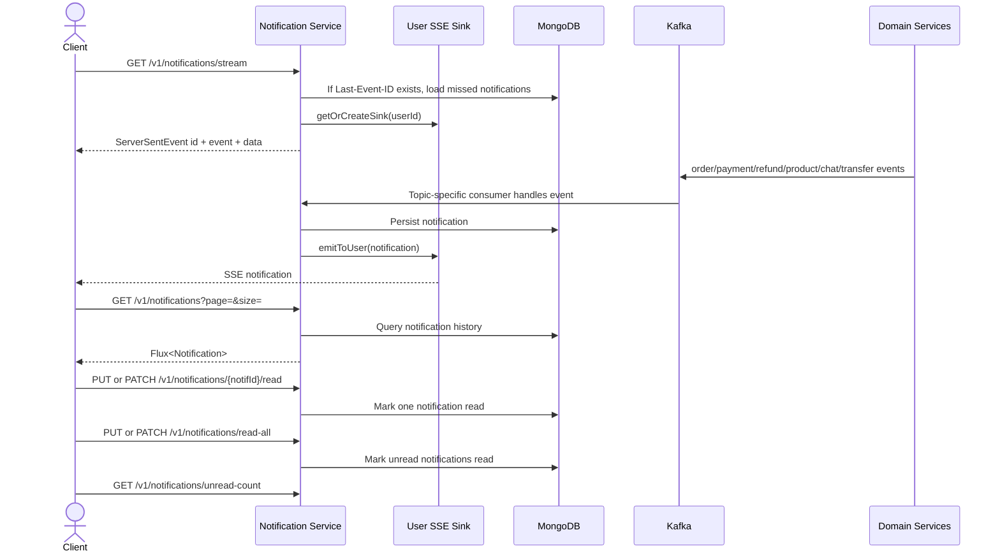

# Business Flow: Notification Stream and Read State
Scope: `notification-service`

### Use Case Coverage

| Use case | Status against current code | Evidence | Notes |
|----------|-----------------------------|----------|-------|
| UC-NOTIF-001: Stream Real-Time Notifications | Implemented | `NotificationController.stream` line 32, `NotificationService.getNotificationStream` line 87 | Uses per-user Reactor sinks for live delivery and persisted Mongo notifications for `Last-Event-ID` replay. |
| UC-NOTIF-002: View Notification History | Implemented | `NotificationController.getNotifications` line 46, `NotificationService.getNotifications` line 95 | Supports page and size query params. |
| UC-NOTIF-003: Mark Notification as Read | Implemented | `NotificationController.markAsRead` line 63, `markAllAsRead` line 72 | Code supports both documented `PUT` and compatibility `PATCH` routes. |

### Sequence Diagram

### Implementation Notes

| Concern | Current behavior |
|---------|------------------|
| Live stream | In-memory Reactor sinks fan out events to connected clients. |
| Replay | `Last-Event-ID` is resolved to a stored notification, then Mongo history after that timestamp is replayed before live events. |
| Consumer modularity | Each Kafka topic family is handled by a focused consumer class under `service.consumer`. |
| Redis Pub/Sub | Redis is not part of the notification replay path in the current implementation. |
