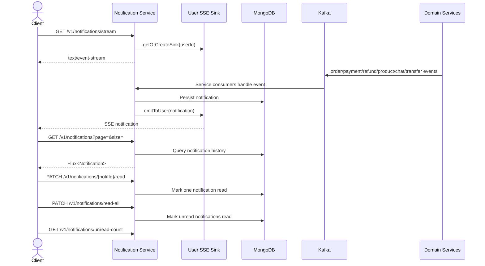

# Business Flow: Notification Stream and Read State
Scope: `notification-service`

### Use Case Coverage

| Use case | Status against current code | Evidence | Notes |
|----------|-----------------------------|----------|-------|
| UC-NOTIF-001: Stream Real-Time Notifications | Implemented | `NotificationController.stream` line 30, `NotificationService.getNotificationStream` line 87 | Uses per-user Reactor sinks and SSE. |
| UC-NOTIF-002: View Notification History | Implemented | `NotificationController.getNotifications` line 46, `NotificationService.getNotifications` line 95 | Supports page and size query params. |
| UC-NOTIF-003: Mark Notification as Read | Implemented with contract drift | `NotificationController.markAsRead` line 56, `markAllAsRead` line 65 | Code uses `PATCH`, while the use case text says `PUT`. |

### Sequence Diagram

### Implementation Gaps

| Gap | Impact |
|-----|--------|
| Use case text says `PUT /notifications/{id}/read` and `PUT /notifications/read-all`; code exposes `PATCH`. | API contract docs should use PATCH to match the implementation. |
| Consumers exist for many topics, but payload-specific formatting is handled inside each consumer class. | Event payload contracts should be documented per topic if strict schemas are required. |
