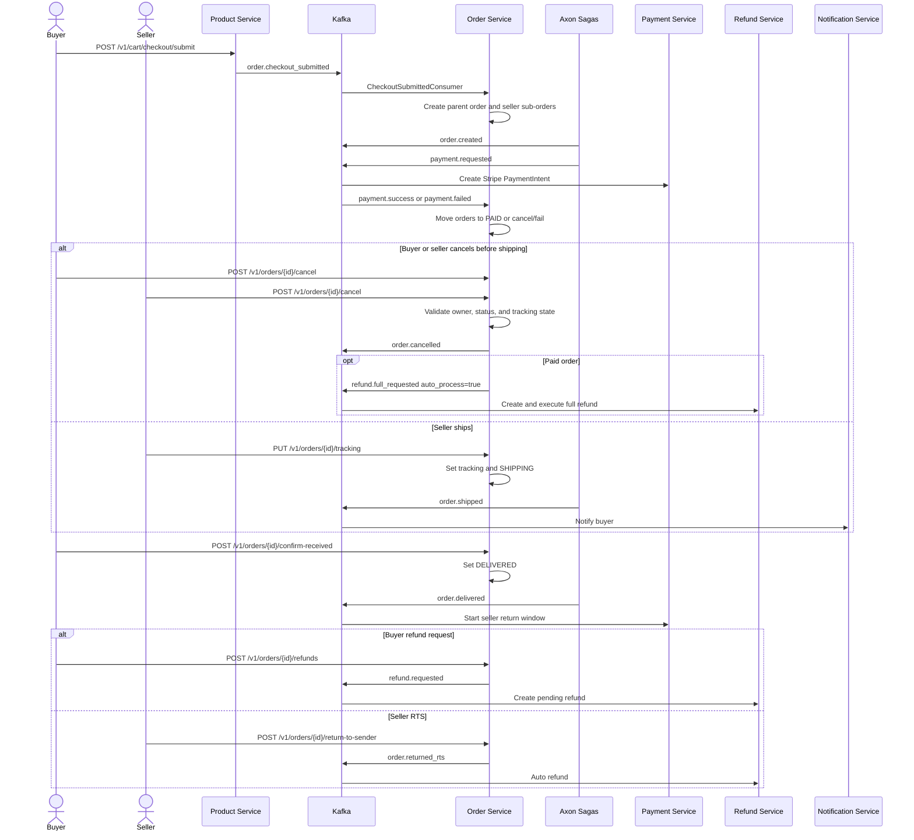

# Business Flow: Order Lifecycle and Returns
Scope: `order-service` plus product, payment, refund, and notification events

### Use Case Coverage

| Use case | Status against current code | Evidence | Notes |
|----------|-----------------------------|----------|-------|
| UC-ORDER-001: Checkout | Implemented async | `CheckoutSubmittedConsumer.onCheckoutSubmitted` line 34, `OrderService.createOrderFromEvent` line 65 | Product-service checkout submit publishes `order.checkout_submitted`; order-service creates parent/sub-orders and payment request. |
| UC-ORDER-002: View Orders | Implemented | `OrderController.getBuyerOrders` line 61, `getOrderDetail` line 87, `getParentOrderDetail` line 103 | Buyer list/detail contracts exist. |
| UC-ORDER-003: Cancel Order (Buyer) | Implemented | `OrderController.cancelOrder` line 120, `OrderService.cancelOrder` line 282 | Buyer can cancel `PENDING` or unshipped `PAID`; paid cancellation publishes `refund.full_requested` with `auto_process=true`. |
| UC-ORDER-004: Ship Order | Implemented | `OrderController.updateTracking` line 137, `OrderService.updateTracking` line 405 | Seller sets tracking and status becomes `SHIPPING`. |
| UC-ORDER-005: Confirm Delivery | Implemented | `OrderController.confirmReceived` line 154, `OrderService.confirmReceived` line 446, `OrderLifecycleScheduler` line 55 | Manual confirm and auto-delivery scheduler are implemented. |
| UC-ORDER-006: Request Return / RTS | Implemented | `RefundController.createPartialRefund` line 64, `OrderController.returnToSender` line 171 | Buyer refund emits refund events; seller RTS emits `order.returned_rts`. |
| UC-ORDER-007: View Seller Orders | Implemented | `OrderController.getSellerOrders` line 195, `getSellerDashboard` line 221 | Seller list and dashboard exist. |
| UC-ORDER-008: Seller Cancel Order | Implemented | `OrderService.cancelOrder` line 282, `OrderService.publishAutoFullRefundRequested` line 353, `OrderProcessingSaga` line 190 | Seller can cancel unshipped `PAID` orders with a reason; order-service publishes seller cancellation and auto full-refund events. |

### Sequence Diagram

### Implementation Notes

| Concern | Current behavior |
|---------|------------------|
| Axon scope | Axon is used inside `order-service` for order/payment saga orchestration. |
| Paid cancellation | Buyer and seller paid-cancel paths emit auto full-refund requests; refund-service can auto-process those requests. |
| Auto lifecycle | `OrderLifecycleScheduler` handles payment timeout and auto-delivery safety paths. |
