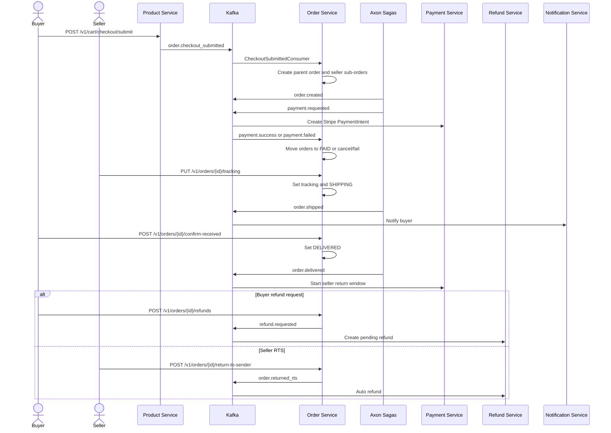

# Business Flow: Order Lifecycle and Returns
Scope: `order-service` plus product, payment, refund, and notification events

### Use Case Coverage

| Use case | Status against current code | Evidence | Notes |
|----------|-----------------------------|----------|-------|
| UC-ORDER-001: Checkout | Implemented async | `CheckoutSubmittedConsumer.onCheckoutSubmitted` line 34, `OrderService.createOrderFromEvent` line 65 | Product-service checkout submit publishes `order.checkout_submitted`; order-service creates parent/sub-orders and payment request. |
| UC-ORDER-002: View Orders | Implemented | `OrderController.getBuyerOrders` line 61, `getOrderDetail` line 87, `getParentOrderDetail` line 103 | Buyer list/detail contracts exist. |
| UC-ORDER-003: Cancel Order (Buyer) | Implemented | `OrderController.cancelOrder` line 120, `OrderService.cancelOrder` line 279 | Only `PENDING` can be cancelled. |
| UC-ORDER-004: Ship Order | Implemented | `OrderController.updateTracking` line 137, `OrderService.updateTracking` line 331 | Seller sets tracking and status becomes `SHIPPING`. |
| UC-ORDER-005: Confirm Delivery | Implemented manual, auto branch delegated/not found here | `OrderController.confirmReceived` line 154, `OrderService.confirmReceived` line 374 | Code comments say worker-service handles auto-delivery, but no worker-service module exists in this repo snapshot. |
| UC-ORDER-006: Request Return / RTS | Implemented | `RefundController.createPartialRefund` line 64, `OrderController.returnToSender` line 171 | Buyer refund emits refund events; seller RTS emits `order.returned_rts`. |
| UC-ORDER-007: View Seller Orders | Implemented | `OrderController.getSellerOrders` line 195, `getSellerDashboard` line 221 | Seller list and dashboard exist. |
| UC-ORDER-008: Seller Cancel Order | Partial | `OrderService.cancelOrder` line 279 | Ownership check accepts seller, but status rule only permits `PENDING`, not `PAID`. |

### Sequence Diagram

### Implementation Gaps

| Gap | Impact |
|-----|--------|
| Seller cancel use case expects `PAID` order cancellation before shipping, but code only accepts `PENDING`. | UC-ORDER-008 should be marked partial until the status rule changes. |
| Auto confirm delivery is referenced as worker-service/JOB-22, but no worker-service directory exists in this repo snapshot. | Treat auto-delivery as external/not implemented in this checkout. |
