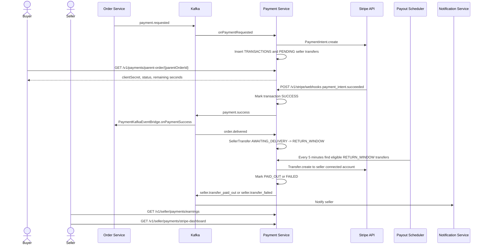

# Business Flow: Payment, Stripe Webhooks, and Seller Payouts
Scope: `payment-service`

### Use Case Coverage

| Use case | Status against current code | Evidence | Notes |
|----------|-----------------------------|----------|-------|
| UC-PAYMENT-001: Onboard Stripe Account | Implemented | `StripeOnboardingController.startOnboarding` line 31, `StripeOnboardingService.startOnboarding` line 34 | Includes status and refresh-link endpoints. |
| UC-PAYMENT-002: Process Payment | Implemented with contract drift | `PaymentService.onPaymentRequested` line 562, `PaymentController.getTransactionByParentOrder` line 30 | Payment creation is event-driven. Lookup endpoint is `/v1/payments/parent-order/{parentOrderId}`, not `/payments/by-order/{id}`. |
| UC-PAYMENT-003: Handle Stripe Webhook | Implemented | `PaymentController.handleStripeWebhook` line 52, `PaymentService.handleWebhook` line 124 | Endpoint is `/v1/stripe/webhooks`. |
| UC-PAYMENT-007: Transfer to Seller | Implemented scheduled flow | `PaymentService.onOrderDelivered` line 682, `PayoutScheduler.processEligiblePayouts` line 61 | Delivery moves transfers to return-window; scheduler pays eligible transfers. |
| UC-PAYMENT-008: View Transfers | Partial | `SellerPaymentsController.getEarnings` line 29, `getStripeDashboardLink` line 43 | Earnings and Stripe dashboard exist; `/transfers` and `/balance` endpoints from the use case were not found. |

### Sequence Diagram

### Implementation Gaps

| Gap | Impact |
|-----|--------|
| UC-PAYMENT-002 endpoint text uses `/payments/by-order/{parentOrderId}`; code exposes `/v1/payments/parent-order/{parentOrderId}`. | API contract docs should be aligned before frontend integration. |
| UC-PAYMENT-003 mentions `/stripe/webhook`; code exposes `/v1/stripe/webhooks`. | Gateway route/docs mismatch risk. |
| UC-PAYMENT-008 transfer history and balance endpoints were not found. | Seller payout UI can use earnings and Stripe dashboard now, but not a dedicated transfer ledger/balance API. |
