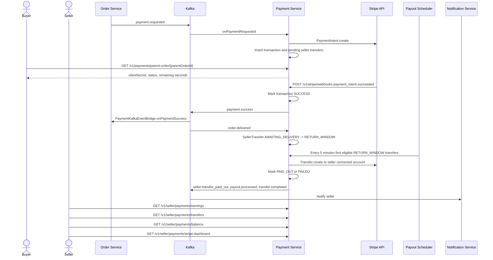

# Business Flow: Payment, Stripe Webhooks, and Seller Payouts
Scope: `payment-service`

### Use Case Coverage

| Use case | Status against current code | Evidence | Notes |
|----------|-----------------------------|----------|-------|
| UC-PAYMENT-001: Onboard Stripe Account | Implemented | `StripeOnboardingController.startOnboarding` line 31, `StripeOnboardingService.startOnboarding` line 34 | Includes status and refresh-link endpoints. |
| UC-PAYMENT-002: Process Payment | Implemented | `PaymentService.onPaymentRequested` line 562, `PaymentController.getTransactionByParentOrder` line 30 | Payment creation is event-driven. Lookup endpoint is `/v1/payments/parent-order/{parentOrderId}`. |
| UC-PAYMENT-003: Handle Stripe Webhook | Implemented | `PaymentController.handleStripeWebhook` line 52, `PaymentService.handleWebhook` line 124 | Endpoint is `/v1/stripe/webhooks`. |
| UC-PAYMENT-007: Transfer to Seller | Implemented | `PaymentService.onOrderDelivered` line 682, `PayoutScheduler.processEligiblePayouts` line 61, `PayoutScheduler.publishPayoutEvent` line 160 | Delayed payout is implemented and successful payouts publish `transfer.completed` in addition to existing seller transfer events. |
| UC-PAYMENT-008: View Transfers | Implemented | `SellerPaymentsController.getSellerTransfers` line 42, `SellerPaymentsController.getSellerBalance` line 59, `SellerPaymentsService.getSellerTransfers` line 87 | Seller transfer history, balance, earnings, and Stripe dashboard endpoints are available. |

### Sequence Diagram

### Implementation Notes

| Concern | Current behavior |
|---------|------------------|
| Transfer event compatibility | `seller.transfer.paid_out` and `payout.processed` remain; `transfer.completed` is also emitted for the documented contract. |
| Balance calculation | Pending balance uses pending/awaiting-delivery/return-window/ready-for-payout states; paid-out transfers count as available. |
| Webhook route | Implemented route is `/v1/stripe/webhooks`; gateway docs should preserve that final route. |
