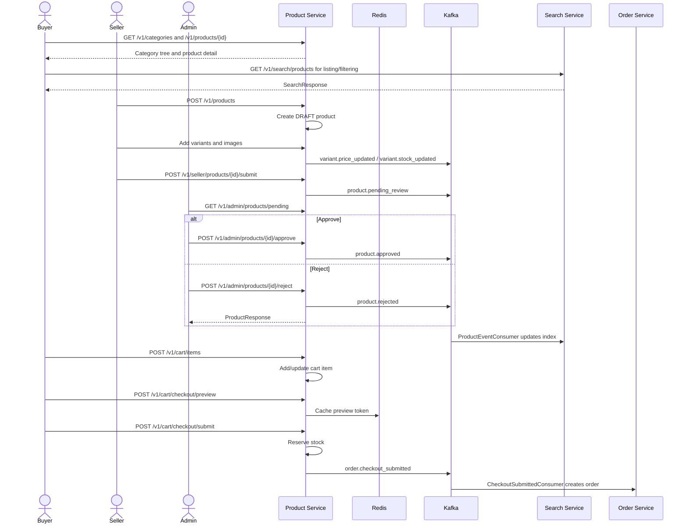

# Business Flow: Product Catalog, Cart, Checkout, and Review
Scope: `product-service` with search/order cross-service edges

### Use Case Coverage

| Use case | Status against current code | Evidence | Notes |
|----------|-----------------------------|----------|-------|
| UC-PRODUCT-001: Browse Catalog | Implemented with search-service split | `CategoryController.getCategoryTree` line 21, `ProductController.getProduct` line 39 | Product listing is handled by search-service; product-service owns detail/category reads. |
| UC-PRODUCT-002: Manage Categories | Implemented | `AdminCategoryController` lines 27, 35, 43; `CategoryService` lines 58, 84, 131 | Category updates publish category events. |
| UC-PRODUCT-003: Create Product | Implemented | `ProductController.createProduct` line 45, `ProductService.createProduct` line 56 | Seller product listing and soft delete are also implemented. |
| UC-PRODUCT-004: Manage Variants | Implemented | `ProductController` lines 79, 89, 96, 105; `VariantService` lines 51, 104, 168 | Variant price/stock events are emitted. |
| UC-PRODUCT-005: Upload Images | Implemented | `ProductController` lines 137, 146, 156, 163; `ImageService` lines 53, 103, 144 | Uses presigned upload URL plus DB image registration. |
| UC-PRODUCT-006: Manage Stock | Implemented | `InventoryController` lines 28, 34, 43; `InventoryService` lines 40, 49, 85 | Inventory log endpoint exists but returns a placeholder list. |
| UC-PRODUCT-007: Reserve Stock | Implemented | `CartController.reserveStock` line 66, `InventoryService.reserveStock` line 136, `CheckoutSubmitService.submit` line 43 | Checkout submit reserves stock and publishes `order.checkout_submitted`. |
| UC-PRODUCT-008: View Cart | Implemented | `CartController.getCart` line 27, `CartService.getCart` line 33 | Cart is loaded for current customer. |
| UC-PRODUCT-009: Add to Cart | Implemented | `CartController.addItem` line 41, `CartService.addItem` line 49 | Validates variant and quantity. |
| UC-PRODUCT-010: Update Cart Item | Implemented | `CartController.updateItem` line 49, `CartService.updateItem` line 90 | Revalidates quantity. |
| UC-PRODUCT-011: Remove from Cart | Implemented | `CartController.removeItem` line 58, `CartController.clearCart` line 34 | Supports item removal and cart clear. |
| UC-PRODUCT-012: Submit Product Review | Implemented | `ProductController.submitForReview` line 113, `ProductService.submitForReview` line 175 | Publish/unpublish are implemented; resubmit lockout is enforced when `rejectCount >= 3`. |
| UC-PRODUCT-013: List Pending Products | Implemented | `AdminProductController.getPendingProducts` line 28, `ProductService.getPendingProducts` line 279 | Admin review queue. |
| UC-PRODUCT-014: Approve Product | Implemented | `AdminProductController.approveProduct` line 36, `ProductService.approveProduct` line 299 | Publishes `product.approved`. |
| UC-PRODUCT-015: Reject Product | Implemented | `AdminProductController.rejectProduct` line 43, `ProductService.rejectProduct` line 332 | Reject returns the updated `ProductResponse`, persists reason/count/status, and publishes `product.rejected`. |

### Sequence Diagram

### Implementation Notes

| Concern | Current behavior |
|---------|------------------|
| Inventory logs | Inventory log endpoint currently returns an empty placeholder; stock mutations themselves are implemented. |
| Reject response | Admin reject now returns the updated product summary body. |
| Resubmit lockout | The 3-strike resubmit lockout is implemented in `submitForReview`, not as a seller-account lock. |
