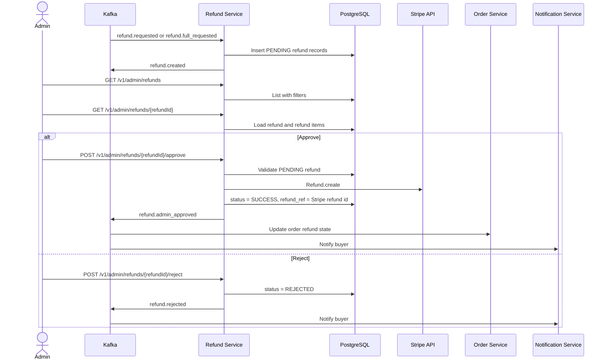

# Business Flow: Refund Admin Review
Scope: `refund-service`

### Use Case Coverage

| Use case | Status against current code | Evidence | Notes |
|----------|-----------------------------|----------|-------|
| UC-REFUND-001: Create Refund | Implemented through Kafka consumers | `RefundService.onRefundRequested` line 264, `onRefundFullRequested` line 355, `onOrderReturnedRts` line 419 | Creation is not exposed as a public refund-service REST endpoint. |
| UC-REFUND-002: Approve Refund | Implemented | `AdminRefundController.approveRefund` line 55, `RefundService.approveRefund` line 153 | Calls Stripe refund and publishes `refund.admin_approved`. |
| UC-REFUND-003: Reject Refund | Implemented | `AdminRefundController.rejectRefund` line 67, `RefundService.rejectRefund` line 223 | Publishes `refund.rejected`. |

### Sequence Diagram

### Implementation Gaps

| Gap | Impact |
|-----|--------|
| Direct `POST /refunds` is not implemented in refund-service. | Client refund initiation should go through order-service endpoints. |
| `RefundService` owns transfer reversal logic; payment-service does not consume `refund.admin_approved` in current code. | Cross-service flow docs should avoid claiming payment-service performs this listener step. |
