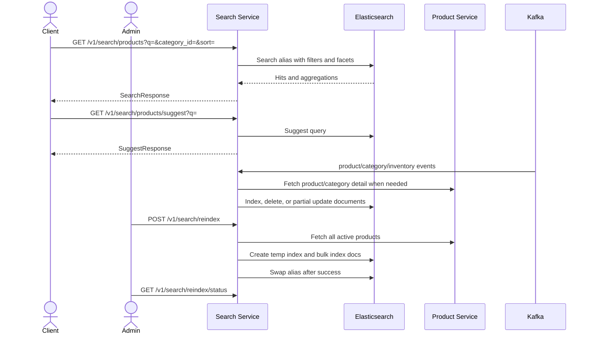

# Business Flow: Search Query, Suggest, and Reindex
Scope: `search-service`

### Use Case Coverage

| Use case | Status against current code | Evidence | Notes |
|----------|-----------------------------|----------|-------|
| UC-SEARCH-001: Product Listing and Search | Implemented | `SearchController.searchProducts` line 24, `SearchQueryService.search` line 16, `ElasticsearchService.search` line 149 | Handles q, category, price, stock, rating, flash-sale, and sort filters. |
| UC-SEARCH-001 alternate: Suggestions | Implemented | `SearchController.suggestProducts` line 42, `SearchQueryService.suggest` line 45 | Returns empty list for short query. |
| UC-SEARCH-003: Trigger Reindex | Implemented | `SearchController.triggerReindex` line 52, `ReindexService.triggerReindex` line 40, `executeReindexAsync` line 64 | Reindex status endpoint exists at line 72. |

### Sequence Diagram

### Implementation Gaps

| Gap | Impact |
|-----|--------|
| Search endpoints are implemented as `/v1/search/...`; gateway/public docs may prefix `/api`. | Keep API gateway route docs explicit to avoid client confusion. |
| Reindex state is stored in-memory in `ReindexService`. | Reindex status resets on service restart. |
