# Cross-Service Flow Diagrams

> Generated: 2026-05-10
> Source: `docs/services/flashsale-service/flashsale_service_flow.md`, `docs/services/product-service/product_service_flow.md`, KAFKA_EVENTS.md files

---

## 1. Flash Sale Lifecycle Flow

### 1.1 Session Creation (Admin)

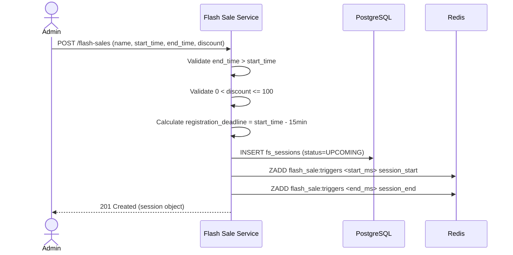

### 1.2 Seller Product Registration

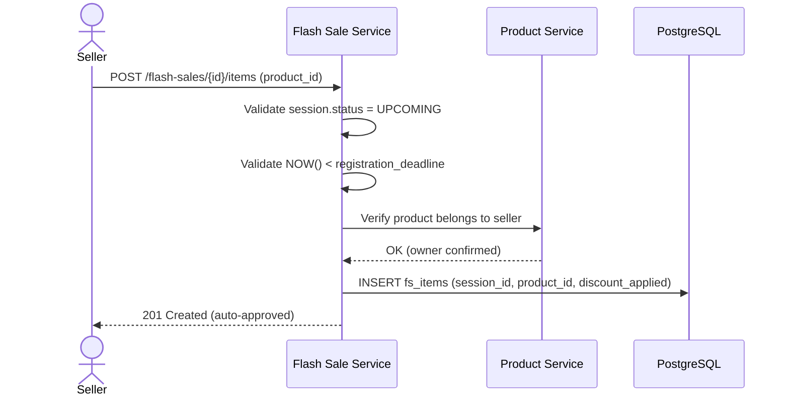

### 1.3 Session Auto-Transition (Redis ZSET Worker)

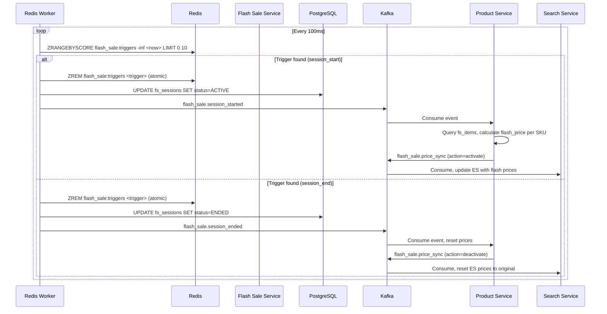

### 1.4 Redis Trigger Latency Comparison

| Method | Max Latency | Precision |
|--------|-------------|-----------|
| Cron 1 min | 60,000ms | +/- 30s |
| Redis Trigger (sleep 100ms) | 100ms | +/- 50ms |
| Redis Blocking BZPOPMIN | 0ms | Exact |

---

## 2. Product Checkout Flow

### 2.1 Browse Catalog

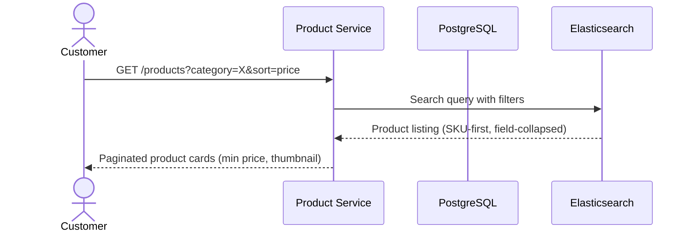

### 2.2 Product Detail with Variant Selection

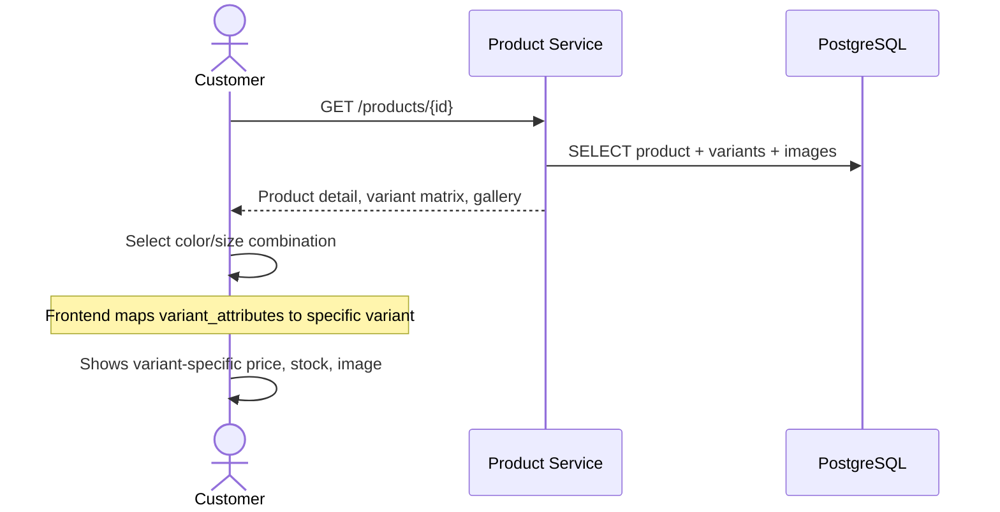

### 2.3 Add to Cart

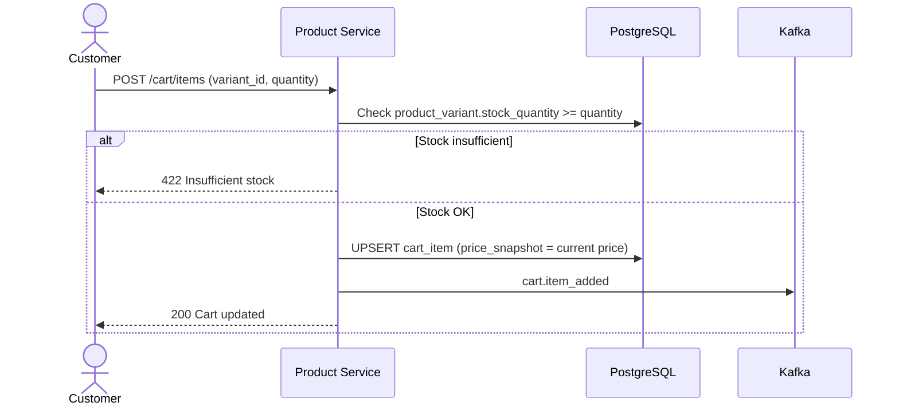

### 2.4 View Cart (Lazy Evaluation)

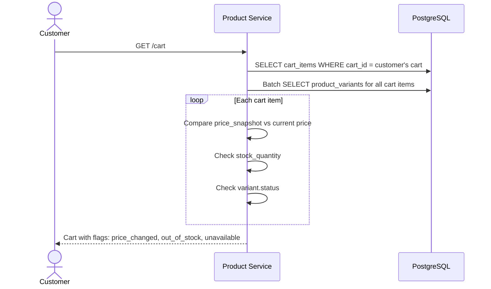

### 2.5 Checkout Preview

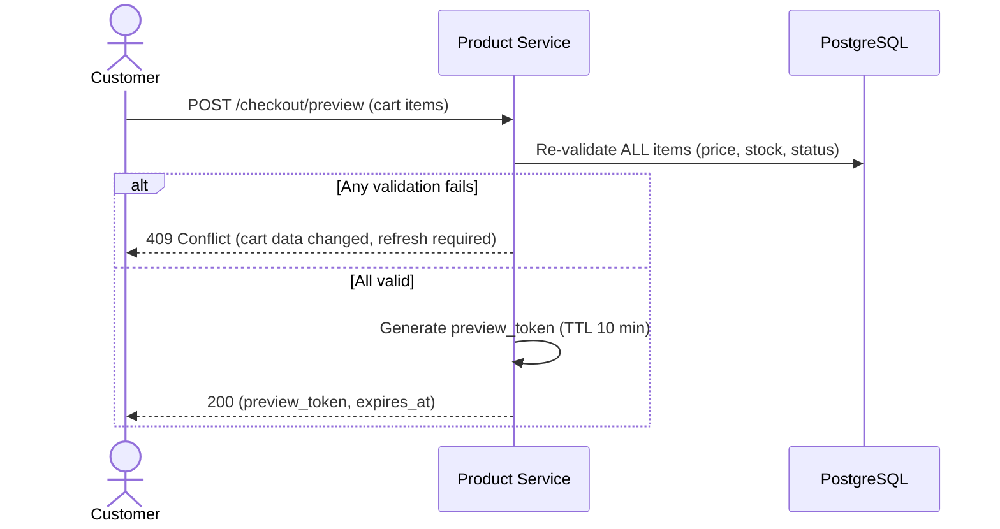

### 2.6 Place Order with Stock Reservation

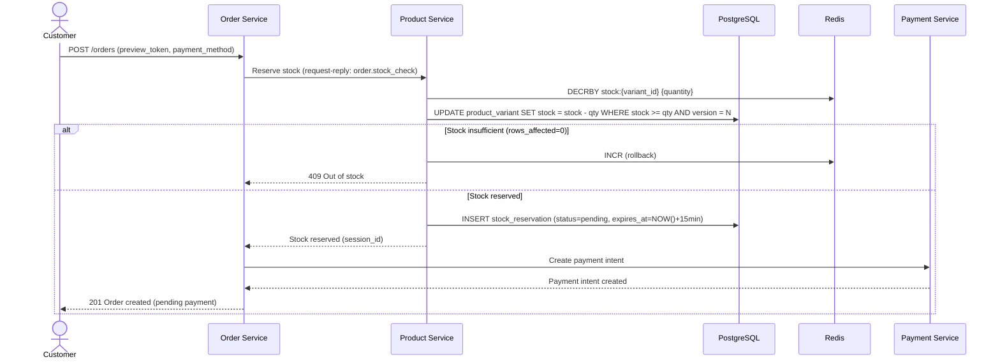

### 2.7 Payment Resolution

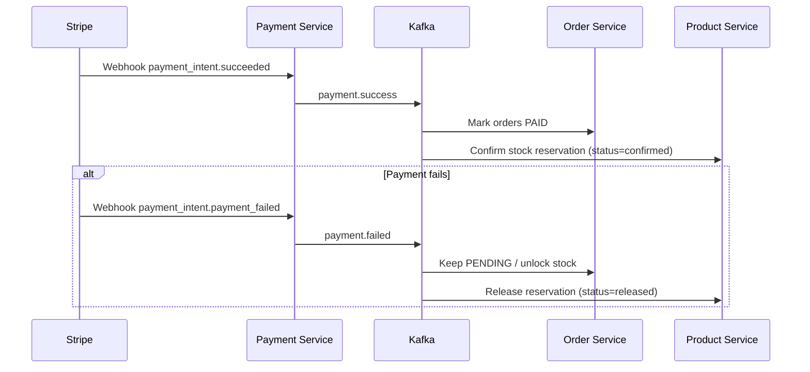

---

## 3. Order Lifecycle Flow

### 3.1 Full Order States

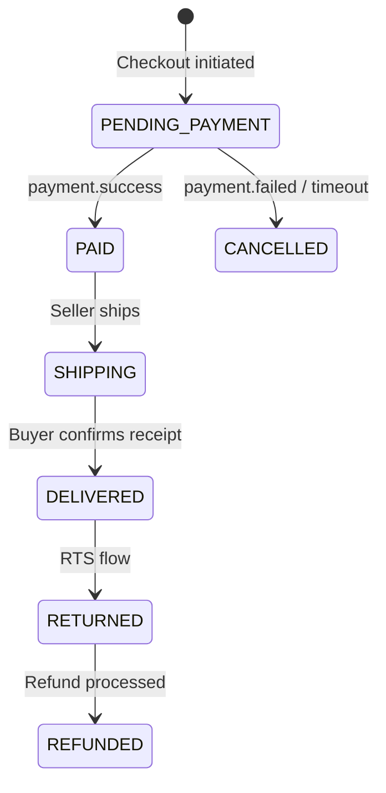

### 3.2 Return To Sender (RTS) Flow

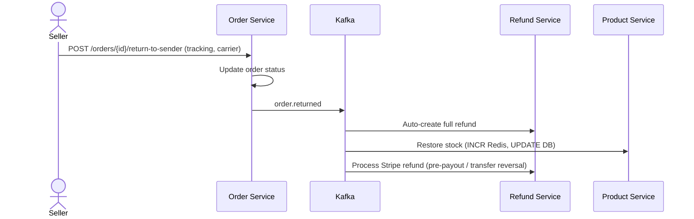

---

## 4. Product Lifecycle

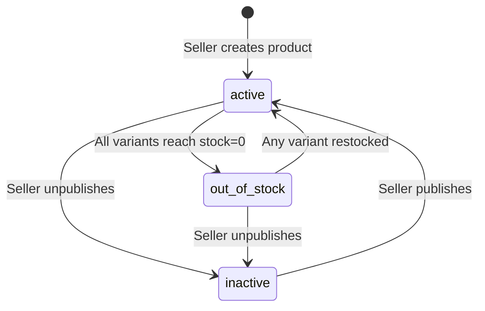

---

## 5. AI Chat Message Flow

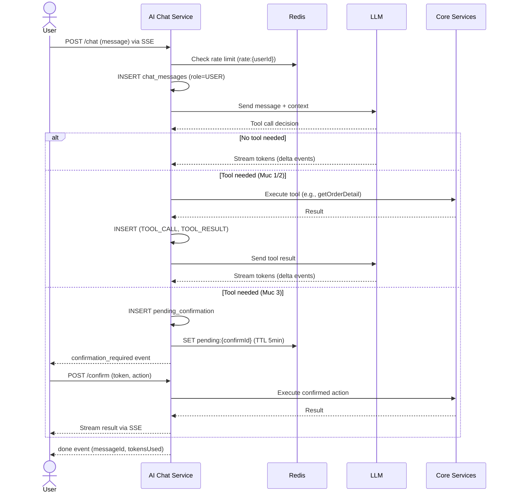

---

## 6. Flash Sale Purchase (Redis Lua Atomic)

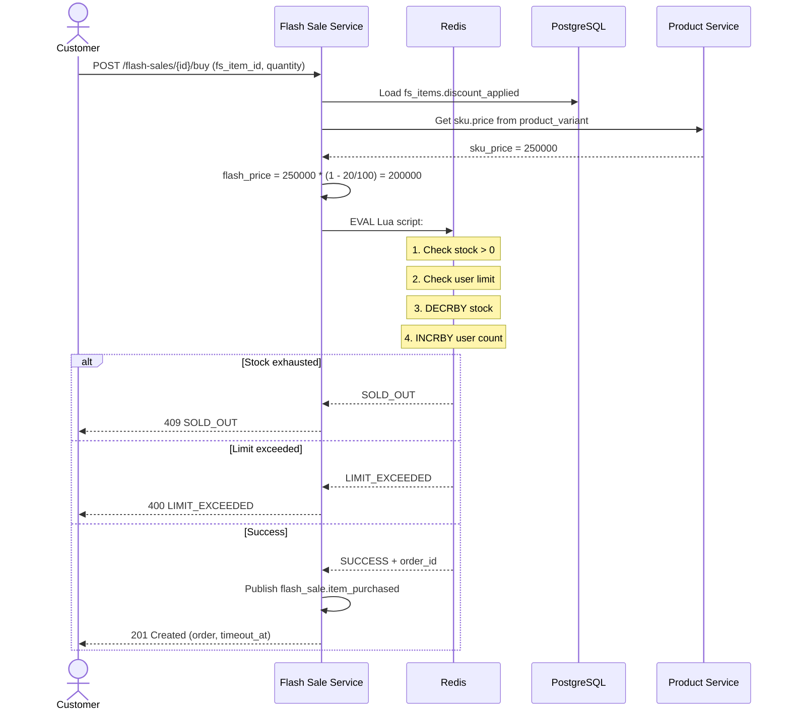
