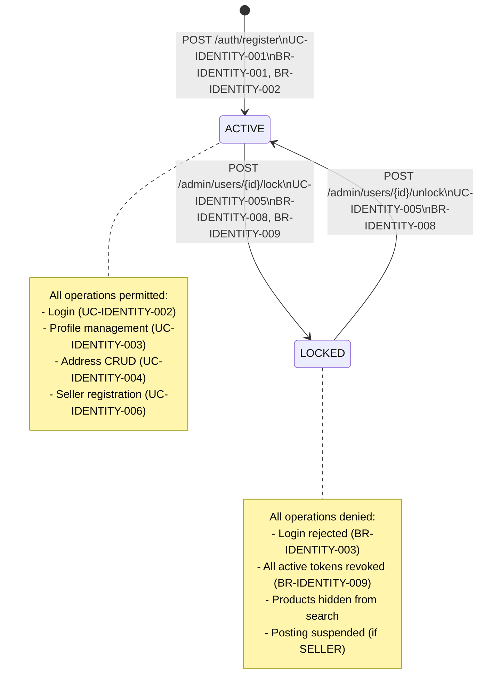

# State Diagram: User Account Lifecycle
Service: identity-service
Entity: ENTITY-IDENTITY-001 (User)

## State Transition Table

| From | To | Trigger | Actor | BR | UC |
|------|----|---------|-------|-----|-----|
| [*] | ACTIVE | POST /auth/register | Guest | BR-IDENTITY-001, BR-IDENTITY-002 | UC-IDENTITY-001 |
| [*] | ACTIVE | POST /auth/register/seller | Guest | BR-IDENTITY-001, BR-IDENTITY-002 | UC-IDENTITY-006 |
| ACTIVE | LOCKED | POST /admin/users/{id}/lock | Admin | BR-IDENTITY-008, BR-IDENTITY-009 | UC-IDENTITY-005 |
| LOCKED | ACTIVE | POST /admin/users/{id}/unlock | Admin | BR-IDENTITY-008 | UC-IDENTITY-005 |

## Lock Side Effects
| Effect | Mechanism |
|--------|-----------|
| Login blocked | BR-IDENTITY-003 returns HTTP 403 |
| Tokens revoked | Redis blocklist -- all JWTs invalidated (BR-IDENTITY-009) |
| Seller products hidden | Search Service consumes account.locked event |
| Notification sent | account.locked -> Notification Service |

## Idempotency
| Operation | Current State | Result |
|-----------|--------------|--------|
| Lock | Already LOCKED | 200 (no-op) |
| Unlock | Already ACTIVE | 200 (no-op) |
