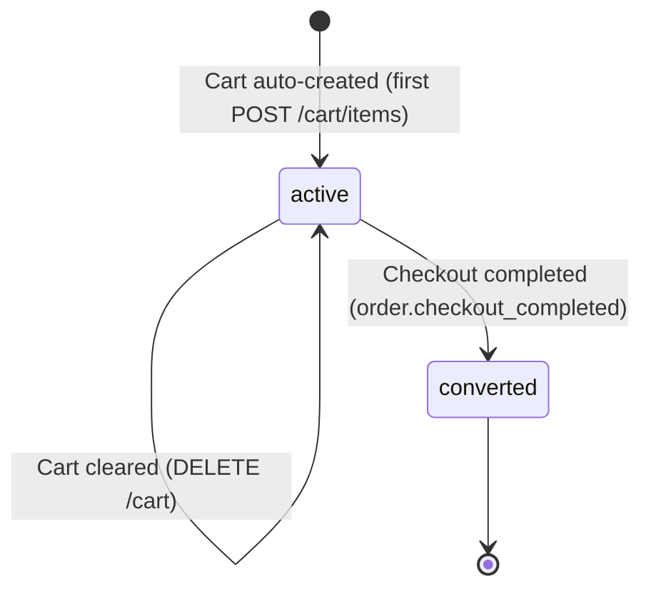

# State Diagram: CART

> **Entity**: ENTITY-PRODUCT-006 (CART)
> **Status Column**: `cart.status` (VARCHAR 50)
> **Last Updated**: 2026-05-09

---

## State Machine



---

## Transition Table

| # | From | To | Trigger | Actor | Business Rule | Use Case |
|---|------|-----|---------|-------|---------------|----------|
| 1 | `[*]` | `active` | `POST /cart/items` with no existing cart -> lazy creation | System | BR-PRODUCT-009 | UC-PRODUCT-009 |
| 2 | `active` | `active` | `PUT /cart/items/{id}` (update quantity) | Customer | BR-PRODUCT-012 | UC-PRODUCT-010 |
| 3 | `active` | `active` | `DELETE /cart/items/{id}` (remove item) | Customer | -- | UC-PRODUCT-011 |
| 4 | `active` | `active` | `DELETE /cart` (clear all items, cart retained) | Customer | -- | UC-PRODUCT-008 |
| 5 | `active` | `converted` | `order.checkout_completed` event received; checked-out items removed | System (Order Service) | -- | UC-PRODUCT-007 |
| 6 | `converted` | `[*]` | Cart items cleared; cart record may be retained or archived | System | -- | -- |

---

## Cart Lifecycle

```
  Customer browses -> no cart exists yet

  First POST /cart/items -> Cart auto-created (status=active)
  |
  +--> GET /cart -> view items
  +--> PUT /cart/items/{id} -> adjust quantities
  +--> DELETE /cart/items/{id} -> remove items
  +--> DELETE /cart -> clear all items (cart persists)

  Customer checks out:
  |
  +--> Checkout Preview validates cart integrity
  |    (price match, stock available, variant active)
  |
  +--> Order placed (order.checkout_completed event)
       -> Checked-out items removed from cart
       -> Cart remains active for future items
```

---

## Event-Driven Side Effects

| Kafka Event | Action | Module |
|-------------|--------|--------|
| `order.checkout_completed` | Remove checked-out items from cart | Cart |
| `flash_sale.session_ended` | JOB-07 removes expired flash sale items from all carts | Cart |
| `order.cancelled` | Unlock inventory (stock_reservation released) | Inventory |

---

## Constraints

| Rule | Detail |
|------|--------|
| One cart per customer | UNIQUE(customer_id) |
| Cart never deleted | Cart record persists; only items are cleared |
| No TTL on cart items | Unlike stock reservations, cart items persist indefinitely |
| Flash sale cleanup | JOB-07 removes expired flash items asynchronously |

---

## Cross-References

| Ref ID | Type |
|--------|------|
| ENTITY-PRODUCT-006 | CART |
| ENTITY-PRODUCT-007 | CART_ITEM |
| BR-PRODUCT-009 | One cart per customer |
| FR-PRODUCT-016 | Get customer cart |
| FR-PRODUCT-020 | Clear entire cart |
| FR-PRODUCT-022 | Cart cleanup on events |
| UC-PRODUCT-008 | View cart |
| UC-PRODUCT-009 | Add to cart |
