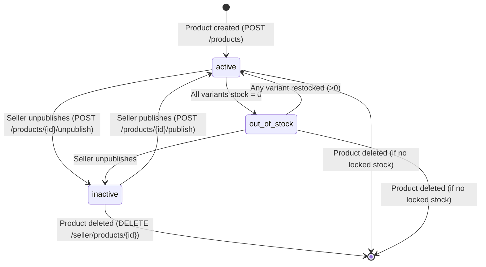

# State Diagram: PRODUCT

> **Entity**: ENTITY-PRODUCT-002 (PRODUCT)
> **Status Column**: `product.status` (VARCHAR 50)
> **Last Updated**: 2026-05-09

---

## State Machine



---

## Transition Table

| # | From | To | Trigger | Actor | Business Rule | Use Case |
|---|------|-----|---------|-------|---------------|----------|
| 1 | `[*]` | `active` | `POST /products` creates product | Seller | BR-PRODUCT-002 (leaf category) | UC-PRODUCT-003 |
| 2 | `active` | `out_of_stock` | All variants reach `stock_quantity = 0` | System (automatic) | BR-PRODUCT-003 | UC-PRODUCT-006 |
| 3 | `out_of_stock` | `active` | Any variant `stock_quantity > 0` again | System (automatic) | BR-PRODUCT-003 | UC-PRODUCT-006 |
| 4 | `active` | `inactive` | `POST /seller/products/{id}/unpublish` | Seller | BR-PRODUCT-003 | UC-PRODUCT-003 |
| 5 | `out_of_stock` | `inactive` | `POST /seller/products/{id}/unpublish` | Seller | BR-PRODUCT-003 | UC-PRODUCT-003 |
| 6 | `inactive` | `active` | `POST /seller/products/{id}/publish` | Seller | BR-PRODUCT-003 | UC-PRODUCT-003 |
| 7 | `active` | `[*]` | `DELETE /seller/products/{id}` (no locked stock) | Seller | -- | UC-PRODUCT-003 |
| 8 | `out_of_stock` | `[*]` | `DELETE /seller/products/{id}` (no locked stock) | Seller | -- | UC-PRODUCT-003 |
| 9 | `inactive` | `[*]` | `DELETE /seller/products/{id}` (no locked stock) | Seller | -- | UC-PRODUCT-003 |

---

## Computation Logic

Product `status` is **derived**, not independently set. It is recomputed in the same transaction as any variant change:

```
IF seller manually set product to inactive:
    status = 'inactive'
ELSE:
    has_active_variant = EXISTS(
        SELECT 1 FROM product_variant
        WHERE product_id = :pid
          AND status = 'active'
          AND stock_quantity > 0
    )
    IF has_active_variant:
        status = 'active'
    ELSE:
        status = 'out_of_stock'  -- still visible on detail page
```

---

## Constraints

| Rule | Detail |
|------|--------|
| Cannot transition directly from `out_of_stock` to `active` | Only happens automatically via variant restock |
| Cannot transition from `inactive` to `out_of_stock` | Seller must publish first, then system evaluates stock |
| Deletion blocked if stock locked | 409 if any variant has active `stock_reservation` with status = pending |

---

## Cross-References

| Ref ID | Type |
|--------|------|
| ENTITY-PRODUCT-002 | PRODUCT |
| ENTITY-PRODUCT-003 | PRODUCT_VARIANT |
| BR-PRODUCT-003 | Product status transitions |
| FR-PRODUCT-004 | Seller create product |
| FR-PRODUCT-007 | Seller update product |
| FR-PRODUCT-008 | Delete product |
