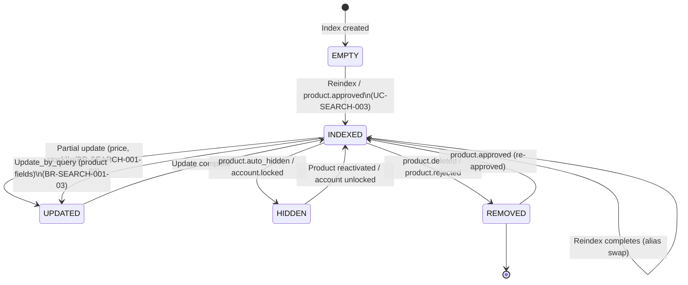

# ST-SEARCH-001: Search Index Lifecycle State Machine

> **Service**: search-service (Port 8091)
> **Index**: `skus` (Elasticsearch)
> **Source**: BR-SEARCH-001

---

## States

| State | Description |
|-------|-------------|
| **INDEXED** | SKU document exists in index, `is_active = true`, visible in search |
| **HIDDEN** | SKU/Product is inactive: `is_active = false`, excluded from search results |
| **UPDATED** | Document fields modified via partial update (price, stock, etc.) |
| **REMOVED** | Document deleted from index entirely |
| **[EMPTY]** | Index does not exist or is newly created (before first data load) |

---

## State Transition Table

| From | To | Trigger | UC/BR Reference |
|------|----|---------|-----------------|
| [EMPTY] | INDEXED | POST /search/reindex (UC-SEARCH-003) or `product.approved` event | UC-SEARCH-003, BR-SEARCH-001-06 |
| INDEXED | UPDATED | Partial update via Kafka event (price/stock change) | BR-SEARCH-001-03 |
| UPDATED | INDEXED | Update completed successfully | BR-SEARCH-001-03 |
| INDEXED | UPDATED | Update_by_query via Kafka (product fields) | BR-SEARCH-001-03 |
| INDEXED | HIDDEN | `product.auto_hidden` or `account.locked` event | BR-SEARCH-001-03 |
| HIDDEN | INDEXED | Product reactivated or account unlocked | BR-SEARCH-001-03 |
| INDEXED | REMOVED | `product.deleted` or `product.rejected` event | BR-SEARCH-001-03 |
| REMOVED | INDEXED | Product re-approved (`product.approved` event) | BR-SEARCH-001-03 |
| INDEXED | INDEXED | Reindex completes (alias swap to new index) | UC-SEARCH-003, BR-SEARCH-001-06 |

---

## State Diagram (Mermaid)

---

## State Invariants

| State | Invariant |
|-------|-----------|
| INDEXED | `is_active = true`, document present in active alias |
| HIDDEN | `is_active = false`, document present but excluded from queries |
| UPDATED | Transient state; resolves immediately to INDEXED |
| REMOVED | Document does not exist in current active index |
| Any | `sku_id` never changes |
| Any | `product_id` never changes |

---

## Cross-References

| Ref ID | Target |
|--------|--------|
| BR-SEARCH-001 | Search business rules |
| UC-SEARCH-003 | Reindex use case |
| ENTITY-SEARCH-001 | SKU document mapping |
